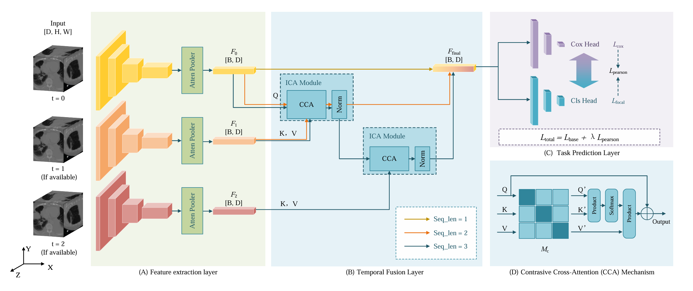

# C2P-Net
This repository contains the official implementation of the paper:
“Contrastive Cross-Attention for Clinically-Consistent Survival Prediction from Longitudinal CT Scans” (Submitted to EMBC 2026)

## 🚀Introduction

Accurate prediction of Progression-Free Survival (PFS) from longitudinal Computed Tomography (CT) scans is crucial for personalizing cancer treatment planning. However, existing methods often fail to effectively model temporal tumor dynamics and can suffer from conflicting objectives in multi-task settings. To address these limitations, we propose the Contrastive Cross-Attention for Clinically-Consistent Prediction Network (C2P-Net). C2P-Net features an Iterative Cross-Attention(ICA) module to fuse temporal information, a novel Contrastive Cross-Attention(CCA) mechanism to capture pathological changes, and a Clinical Logic Consistency Loss($L_\mathrm{pearson}$) to align task objectives. Extensive experiments on a real-world clinical dataset demonstrate the superiority of our method. Compared to a strong baseline using a standard attention mechanism, C2P-Net achieves an absolute improvement of 3.3\% in Avg AUC (from 0.777 to 0.803) and 4.5\% in C-index (from 0.647 to 0.676), confirming the effectiveness of our proposed contrastive strategy. Our results indicate that explicitly modeling feature dissimilarity and enforcing clinical consistency are key to robust longitudinal survival prediction. Furthermore, this model can stratify patients into high-risk and low-risk groups, where patients in these two groups showed a significant difference in PFS (P < 0.001).





## 🛠️ Installation

```bash
git clone https://github.com/MenchYoung/C2P-Net.git
cd C2P-Net
pip install -r requirements.txt
```

## 🏃‍♂️Training
```bash
python main.py
```

## 🏃‍♂️test
```bash
python test.py
```

## 📝 Citation
If you find this work useful, please cite our paper: comming soon...
